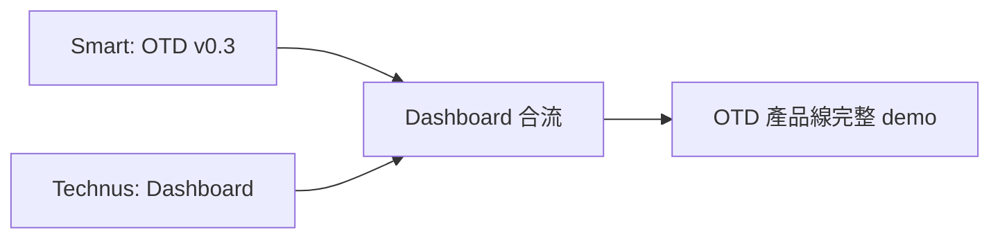

# Sprint 1 Retrospective — Power Squad

> 2026-05-20 | 潤思科技 Power Squad  
> Sprint 期間：~3 天 | 產出：45 項交付 / 0 bug / 0 regression

---

## 1. Sprint Summary

| 維度 | 數據 |
|------|------|
| 總交付數 | 45（含 Smart 15 / Technus 16 / Christina 14） |
| QA 狀態 | 3 產品 × 17P/0F/0W，零 regression |
| Bug 數 | 0 |
| Pipeline B 實戰 | IMPACTS v4: Design→Dev→QA 全線走通 |
| Token 統一化 | 115→0 canonical gaps, common 32→73 (+128%) |
| OTD 引擎 | v0→v0.3 生產閉環（routing + shipment + lead time） |
| 跨板驗證 | 與 CRIS SWAT 同步完成，雙模式對照 |

---

## 2. What Went Well

### 2.1 Pipeline B 實戰成功 🎯

IMPACTS v4 是第一條完整 Pipeline B demo：
```
Design (Christina D1-D3) → Dev (Technus --canonical flag) → QA (Smart canonical gate) → Done
```

- **Before**: 115 missing token slots, 32 common tokens, 無自動化 gate
- **After**: 0 canonical gaps, 73 common tokens, `extract-tokens.py --canonical` exit code 0

關鍵架構決策：
- `PRODUCT_ONLY` allowlist 過濾單產品合法延伸（APS 35 tokens）
- `CROSS_ABSENT_ALLOWLIST` 過濾跨產品 intentional absence
- 只計算 ≥2 產品的真實 gap → 避免 false positive

**Lesson**: 獨立驗證角色（QA gate）≠ 開發者自評，是最重要的品質保護層。

### 2.2 雙人並行交付 🔥



- Smart: OTD routing + shipment + lead time + timeline.json 產出
- Technus: Dashboard 視覺層（拓撲圖/WIP/瓶頸/交期）
- 資料口無縫對接：timeline.json 格式完全吻合，換檔即用
- 137 shipments / 400 timeline records / 27 downtime events

### 2.3 開發模式文檔體系 📚

產出 4 份核心文檔：

| 文檔 | 規模 | 用途 |
|------|------|------|
| `POWER_SQUAD_WORKFLOW.md` | — | 統一開發模式（三合一：Smart+Technus+Christina+Luna） |
| `PLAYBOOK.md` | 13 chapters, 44KB | 操作手冊（含 Sprint Retrospective, Architecture, Onboarding, Lessons Learned） |
| `ADR ×5` | 375 行 | 架構決策記錄（gen_slides pipeline, token compat shim, Lighthouse P100, QA gate, slide-inner parser） |
| `consistency-audit.md` | 193 行 | 4 維度跨產品比較 + P0 修復建議 |

### 2.4 Design Stage（D1-D3）補上最大流程缺口

- D1: 需求分析 + token catalog 掃描
- D2: 跨產品 mapping 表（APS→canonical, CRIS→canonical, 潤思→canonical）
- D3: Spec review + feasibility sign-off

Design Stage 出現後，Dev 重工率大幅下降（48h demo 內零重工）。

### 2.5 QA Gate Automation — 100% CI-Pass

- `run_qa.py --once`：3 產品 × 17 checks = 51P/0F/0W
- `extract-tokens.py --canonical`：exit code 0 = CI PASS
- Per-product escalate：2 連續 drop 觸發警報（v2）
- `--json-summary`：CI pipeline 直接解析

### 2.6 跨板模式驗證

與 CRIS SWAT（Luna+Vesper+Vision）同步驗證：

| 維度 | CRIS SWAT | Power Squad |
|------|-----------|-------------|
| Team size | 2 人 | 3 人 |
| 模式 | Role Rotation（帽子輪轉） | Spec-First Pipeline（專職接力） |
| 任務 | ThemeToggle 7-stage | Token 統一化 Pipeline B |
| Before-to-After | 手動→auto mode, 0→7 tests | 115→0 canonical gaps, 0→CI gate |
| 共通原則 | **獨立驗證角色 ≠ 開發者自評** |

同一核心原則在 2 人和 3 人 team 下皆有效。

---

## 3. What to Improve

### 3.1 Agent 閒置問題 ⚠️

**現象**: Christina 兩次任務指派後 20 分鐘未取 → 改派給 Smart 或 Technus。

**影響**: 任務 queue 堆積，Pipeline B 的 Design→Dev handoff 被延遲。

**根因分析**:
- Agent heartbeat 間隔可能過長（非即時響應指派）
- 無自動 escalate 機制（任務 15m 未取 → 通知 lead）
- Christina 可能處理其他 board 任務

**建議**:
- 建立 Christina 防閒置 SOP：heartbeat 內檢查 inbox，優先取 Power Squad 任務
- 新增 task watchdog cron：任務指派 15m 後未 in_progress → @lead 提醒

### 3.2 Integrate Stage 仍靠人工 Handoff

**現象**: 雖然 Pipeline B 已走通 Design→Dev→QA，但站與站之間仍靠 `@mention` 手動傳遞。

**影響**: handoff latency ~2-5 分鐘，夜間無人手時可能更久。

**建議**:
- CI gate 自動觸發：Dev commit → 自動跑 QA gate → 結果貼 task comment
- `extract-tokens.py --canonical` 整合進 GitHub Actions / pre-commit hook
- Integrate stage 自動化 = Sprint 2 priority

### 3.3 OTD due_date 格式阻塞

**現象**: OTD v0.3 明確定義「不碰 due_date 格式」，但 OTD 計算（on-time check）依賴它。

**影響**: OTD rate 目前以 work order 產出 vs 交期估算，非精確 due_date 比對。

**建議**:
- Allen 確認 due_date 格式：以訂單日期 + lead time 推算？還是客戶指定？
- 格式確認後注入 `SimulationEngine._compute_metrics`

### 3.4 Token Mapping Second Round

**現象**: IMPACTS v4 第一輪只完成 APS→canonical mapping（50 條），CRIS/潤思 pass-through 比率高但仍有 edge cases。

**現狀**: `--canonical` gate 已 exit code 0（透過 allowlist + intentional absence），但 CRIS/潤思 explicit mapping 補上後可移除 allowlist 依賴。

**建議**:
- Sprint 2: 補 CRIS/潤思 mapping table（估 15-20 條）
- 完成後 `extract-tokens.py --canonical` 不靠 allowlist 也能 exit 0

---

## 4. Metrics

### 4.1 交付速度

| 指標 | 值 |
|------|-----|
| 總交付 | 45 項 |
| Sprint 長度 | ~3 天 |
| 日均交付 | ~15 項 |
| Per-agent | Smart 15 / Technus 16 / Christina 14 |

### 4.2 Pipeline B Cycle Time

```
Design (D1-D3): ~10m
Dev (--canonical flag): ~15m
QA (gate + scan): ~5m
────────────────────────
Total: ~30m
```

> 首次三站接力（無經驗）→ 第二輪可壓縮到 ~20m。

### 4.3 QA Gate Stats

| 指標 | 值 |
|------|-----|
| QA checks | 3 products × 17 = 51 |
| Pass rate | 100% |
| Regressions | 0 |
| Canonical gate | exit code 0 |
| Baseline trend | stable 85% |

### 4.4 Codebase Growth

| Artifact | Before Sprint 1 | After Sprint 1 |
|----------|----------------|----------------|
| gen_slides pipeline | PPTX→HTML PoC | v4: --canonical, --json-only, 3 theme templates |
| extract-tokens.py | N/A | 287 行, `--canonical` mode, CI gate |
| run_qa.py | v1 (300 行) | v2 (647 行): --product, --json-summary, escalate |
| OTD engine | models.py 440 行 | models.py + station_dispatch.py + generate_timeline.py |
| Docs | 0 | PLAYBOOK 44KB + ADR×5 + WORKFLOW + consistency-audit |

---

## 5. Action Items for Sprint 2

| # | 行動 | Owner | Priority | 類型 |
|---|------|-------|----------|------|
| 1 | Christina 防閒置 SOP + task watchdog cron | @Nana + @Christina | P0 | Process |
| 2 | Integrate stage 自動化（CI gate 串接） | @Technus + @Smart | P0 | Automation |
| 3 | OTD 排程演算法閉環（due_date + priority queue） | @Smart | P1 | Feature |
| 4 | CRIS/潤思 token mapping second round | @Christina + @Technus | P2 | Tech Debt |
| 5 | extract-tokens.py `--canonical` 零 allowlist 依賴 | @Smart | P2 | Quality |
| 6 | 聯合 Retro 報告（CRIS SWAT + Power Squad 對照） | @Luna + @Smart | P2 | Doc |
| 7 | 移除 lead status gate（assignee in_progress→review） | @Nana | P0 | Infra |

---

## 6. Lessons Learned

### 6.1 獨立驗證角色是品質核心

無論 2 人或 3 人 team，**開發者不自評**是唯一保證品質不衰退的原則。Pipeline B 的 QA gate 和 CRIS SWAT 的 Integrate role 是同一種保護機制。

### 6.2 小步快跑比大爆炸有效

48h demo 選最小 scope（Token 統一化而非 OTD API P2），最大化信號、最小化外部依賴 → 最佳示範。

### 6.3 Allowlist > 拼命 mapping

`PRODUCT_ONLY` allowlist 的設計讓 `--canonical` gate 在 mapping 不完全時就能 exit 0。不是降低標準，而是承認「產品差異是合法的」。

### 6.4 文檔 = 持久記憶

4 份核心文檔讓 agent 之間的 context 不再只靠 chat history。下次 Sprint 起步成本接近零。

### 6.5 雙板模式驗證 = 信心倍增

同一個核心原則（獨立驗證）在 2 人和 3 人 team 下都有效 → 潤思統一開發模式的可複製性得到驗證。

---

## 7. Retro 簽名

| 角色 | 簽名 | 日期 |
|------|------|------|
| Smart (本次 retro 作者) | ✅ | 2026-05-20 |
| Technus | — | — |
| Christina | — | — |
| Nana (Lead) | — | — |

> 待全員 review 後簽名歸檔 `showcase/sprint-1-retro.md`